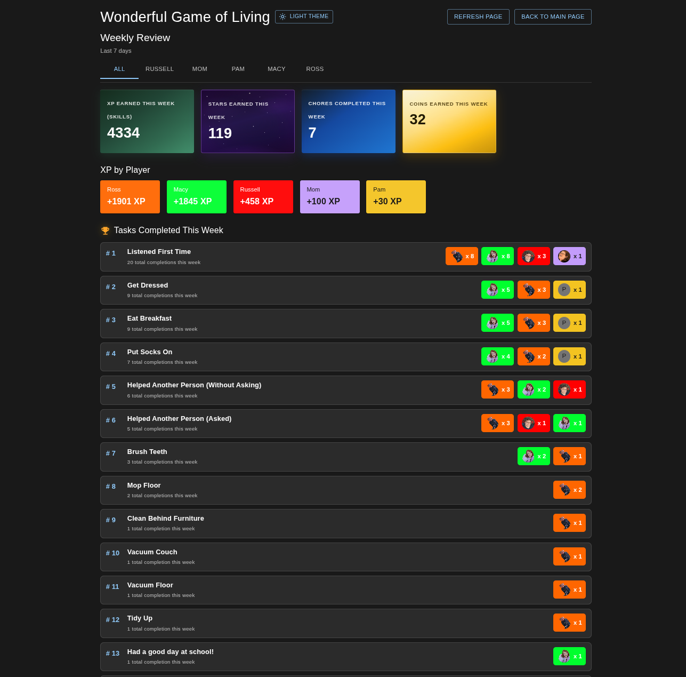
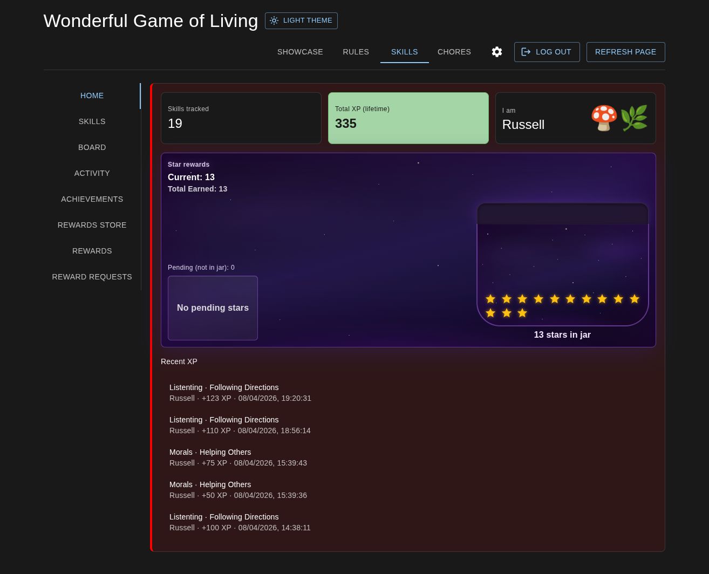
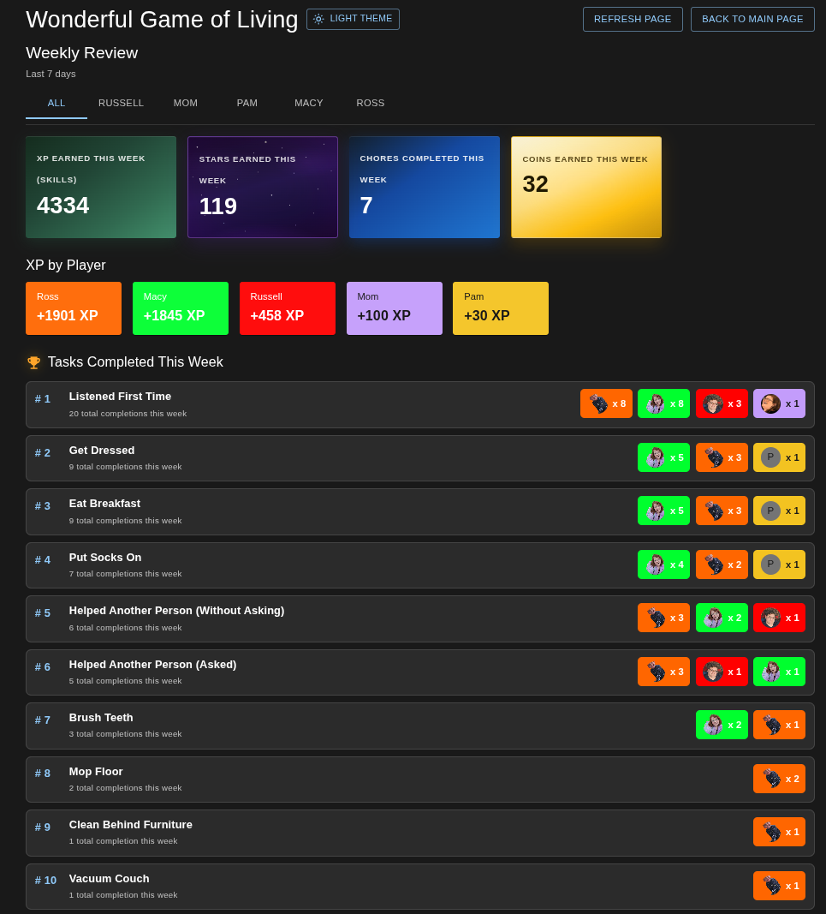
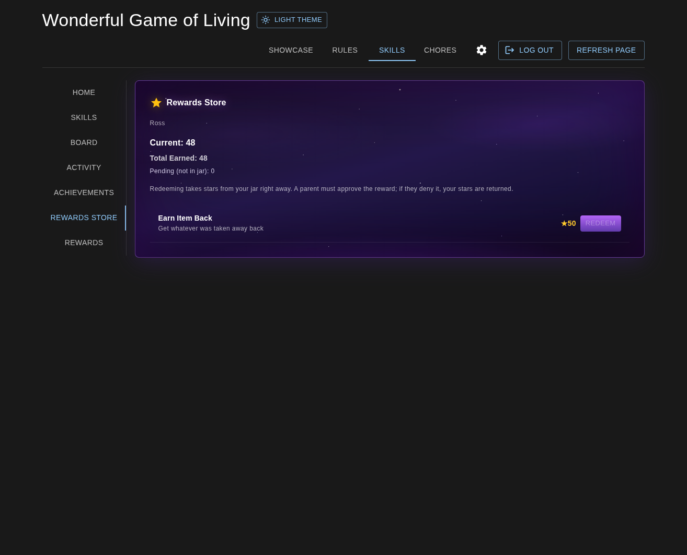
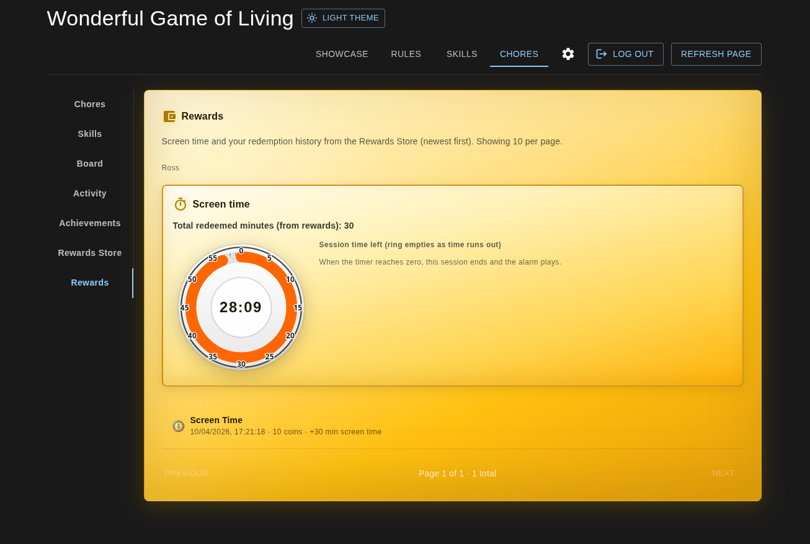

# Wonderful Game

**Wonderful Game** is a local-first web app for families: track **skills** and **sub-skills**, earn **XP** and **levels**, complete **chores** and **daily quests**, collect **coins** and **stars**, redeem **rewards** (including **screen time**), and show progress on a customizable **showcase**.  

A React SPA talks to a small **Express** server; **all data** lives in one JSON file (`state.json`). The same server exposes a **REST API** for automation, NFC, scripts, and integrations (see [API](#http-api) below).

The recommended way to run it is **Docker**: one container serves the API **and** the static UI on **port 2988** (no separate `/api` host or proxy path required for the single-app build).

---

## Screenshots

Images live in [`docs/screenshots/`](docs/screenshots/). See [`docs/screenshots/README.md`](docs/screenshots/README.md) for filenames and capture hints.

| | |
| --- | --- |
|  |  |
| **Weekly Review** — session summaries and read-focused weekly view. | **Overview** — stars, coins, and player progress at a glance. |
|  |  |
| **Skills Home** — skills landing: navigation into tree, tasks, and rewards areas. | **Skills** — skill tree, XP, sub-skills, tasks, and board-style progress. |
|  |  |
| **Rewards** — rewards store, redemptions, and screen time. | **Chores** — quests, chores by room, effort, and coin/star earnings. |
|  |  |
| **Chores / screen time** — timer session (dial, limits, and chore-linked flow). | **Showcase** — customizable dashboard tiles (streaks, highlights, stats). |

---

## What you can do in the app

### Roles and access

- **Life Master** — full control: settings, players, skills, chores, rewards, XP grants, pins.
- **Player** — sign in with a per-player PIN; see skills, chores, and rewards allowed for that profile.
- **Overview** / **Weekly Review** — read-focused views for summaries (depending on how you configure sessions).

### Main areas (top navigation)

- **Chores** — chore lists by **room**, **daily / weekly / monthly** schedules, **effort** levels, **quests** for the day, **coins** and **stars** from chores, chore-specific **skill** links.
- **Skills** — **Home**, **Skills** tree (categories and sub-skills), **Tasks** (Life Master), **Board** (leader-style view), **Activity** (XP log), **Achievements**, **Rewards Store**, **Rewards** (redemptions, **screen time** timer), **Reward Requests**.
- **Showcase** — draggable **grid** of tiles (stars, streak, coins, achievements, skill highlights, etc.).
- **Rules** — editable **house rules** page (themes, sections).

### Gameplay and economy

- **XP** and **levels** (with a level cap on the server), **skill points** and **skill tree** unlocks.
- **Stars** (pending, earned, banked) and **star rewards**; **coins** and **coin rewards**; **reward requests** and approval flows.
- **Screen time** bank from **rewards**, with a **session timer** (per-turn limits, favorite-color dial).
- **Chore themes** (e.g. unicorns, trucks), **chore skills** (separate skill list for chore UI), **images** and **icons** for skills.

### Mobile shell

An **Android** WebView shell in [`android-app/`](android-app/) can point at your server URL for a home-screen experience (optional). The shell allows **portrait and landscape**; build the APK from that folder when you change it.

---

## NFC tags and NFC Tools

The server accepts **`POST`** requests with the Life Master **PIN** in the **query string** (or headers / JSON / form body — see [`server/API.md`](server/API.md)). That matches how **NFC Tools** (Android) and similar apps send **HTTP POST** tasks: one URL plus **form-style POST parameters** (`application/x-www-form-urlencoded`), which Express maps to `req.body` the same as JSON.

### Before you program a tag

1. **Server URL** — Use the machine that runs Wonderful Game, including port **`2988`** unless you reverse-proxy. Example: `http://192.168.1.50:2988`. The phone must reach this host (same Wi‑Fi or VPN).
2. **Use the `/api` path** if your public site only forwards `/api/*` to Node; otherwise `http://host:2988/...` and `http://host:2988/api/...` both work on the bundled server.
3. **PIN** — Put the Life Master PIN in the **Request URL** as **`?pin=YOUR_PIN`** (recommended for NFC Tools). You can use **`pin`** as a POST parameter instead; do not commit real PINs into the repo.
4. **Exact strings** — `playerName`, `skillName`, `subSkillName`, `taskId`, and `choreId` must match **state** in the app (same spelling and casing). Use **`GET /chores/summary`** or **`GET /chores`** to copy **`choreId`** values (not the chore title).

### NFC Tools (Android) — field-by-field

Create a task (e.g. **Network** → **HTTP Request** / **HTTP POST**, depending on NFC Tools version):

| Field | What to enter |
|--------|----------------|
| **Request URL** | Full URL including query PIN, e.g. `http://192.168.1.50:2988/api/chores/complete?pin=1234` |
| **Request method** | `POST` |
| **Content-Type** | `application/x-www-form-urlencoded` (often the default for “POST parameters”) |
| **POST parameters / body** | One parameter per line, `name=value` (see examples below). No JSON required for form mode. |

If the app offers **“POST parameters”** as separate key/value fields, add each name and value below. If it only has a **raw body**, use the same `key=value` lines joined with `&` (standard URL encoding for spaces in values).

### Example: complete a chore (NFC tap)

1. List ids: `curl -s http://192.168.1.50:2988/chores/summary` (or `/api/chores/summary`).
2. **Request URL:** `http://192.168.1.50:2988/api/chores/complete?pin=YOUR_PIN`
3. **POST parameters:**

   | Name | Example value |
   |------|----------------|
   | `playerName` | `Alex` |
   | `choreId` | `chore_1700000000000_abc12` |

### Example: grant XP to a sub-skill

**Request URL:** `http://192.168.1.50:2988/api/xp/sub-skill?pin=YOUR_PIN`

| Name | Example value |
|------|----------------|
| `playerName` | `Alex` |
| `skillName` | `Reading` |
| `subSkillName` | `Comprehension` |
| `amount` | `25` |
| `whatHappened` | `NFC tag` |

### Example: complete a task by id

**Request URL:** `http://192.168.1.50:2988/api/tasks/complete?pin=YOUR_PIN`

| Name | Example value |
|------|----------------|
| `playerName` | `Alex` |
| `taskId` | (from **Settings → API** in the app, or `GET /tasks`) |
| `whatHappened` | `Tag scan` |

### Security note

Anyone who can send requests to your server with a valid PIN can change data. Use **HTTPS** and a **reverse proxy** on untrusted networks; treat tags like physical keys.

---

## HTTP API

The backend is a **JSON REST API** on the same port as the web app (default **2988**).

- **Base URL:** `http://<host>:2988` — routes also work under **`/api/...`** (e.g. `GET /skills` and `GET /api/skills`) so reverse proxies can forward `/api` only if needed.
- **GET** requests are **unauthenticated** (read-only data).
- **POST** requests that change state require the **Life Master PIN** via header (`X-Life-Master-Pin`), `Authorization: Bearer`, query `?pin=`, or JSON body — see full docs.

**Examples of what the API exposes:**

| Area | Examples |
|------|-----------|
| State | `GET /state`, `POST /state` (PIN, backup/merge) |
| Auth | `POST /auth/verify-life-master` |
| Skills & XP | `GET /skills`, `POST /skills`, `POST /xp/sub-skill` |
| Tasks | `GET /tasks`, `POST /tasks/complete` |
| Chores | `GET /chores`, `GET /chores/summary`, `POST /chores`, `POST /chores/complete`, `POST /chores/delete` |
| Quests | `POST /quests/today` |
| Players | `GET /api/players/:playerName/pending-stars` |

Full reference, **curl** examples, and **reverse-proxy** notes: **[`server/API.md`](server/API.md)**.

---

## Run with Docker Compose (recommended)

### 1. Configure where data is stored on your machine

Game data (`state.json`) is kept in a **host folder** mounted into the container at `/data`.

1. Copy the example env file and edit it:

   ```bash
   cp .env.example .env
   ```

2. Open **`.env`** and set **`HOST_DATA_PATH`** to an absolute directory on your machine (create the directory if needed). Example:

   ```bash
   HOST_DATA_PATH=/mnt/storage/Services/Wonderful-Game
   ```

   Use a path that exists (or that you can create) and that Docker can read/write. On Windows with Docker Desktop, use a path your engine allows (often under your user profile or a shared drive).

The repository **does not** commit `.env` (it is listed in `.gitignore`). Only **`.env.example`** is tracked as a template.

### 2. Start the stack

From the repository root:

```bash
docker compose up -d --build
```

(`docker-compose up` works too on older Docker installs.)

Then open **http://localhost:2988** in your browser.

- **Stop:** `docker compose down`
- **Logs:** `docker compose logs -f`

If `HOST_DATA_PATH` is missing from `.env`, Compose falls back to **`./data`** in the project root (same directory as `docker-compose.yml`).

---

## Run with Docker only (no Compose)

Build the image from the **root** `Dockerfile`:

```bash
docker build -t wonderful-game .
```

Run with a bind mount (set your path or export from `.env`):

```bash
docker run -d --name wonderful-game -p 2988:2988 \
  -e PORT=2988 \
  -e DATA_DIR=/data \
  -e STATIC_DIR=/app/client/build \
  -v /mnt/storage/Services/Wonderful-Game:/data \
  wonderful-game
```

Adjust `-v` to match your `HOST_DATA_PATH`. Open **http://localhost:2988**.

---

## Environment variables

### Docker Compose (project root `.env`)

| Variable          | Description |
|-------------------|-------------|
| `HOST_DATA_PATH`  | Host directory mounted as `/data` in the container (where `state.json` lives). |

### Inside the container (set by Compose / image)

| Variable     | Default | Description |
|--------------|---------|-------------|
| `PORT`       | `2988`  | HTTP port inside the container. |
| `DATA_DIR`   | `/data` in Compose | Where `state.json` is written inside the container. |
| `STATIC_DIR` | `/app/client/build` in the image | Path to the React production build. |

See [`server/server.js`](server/server.js) for details.

---

## Development without Docker

Use two terminals:

1. **API:** `cd server && npm install && npm start` (default **http://localhost:2988**)
2. **Client:** `cd client && npm install && npm start` (CRA dev server)

If the UI cannot reach the API, copy `client/.env.example` to `client/.env.local` and set `REACT_APP_API_URL` to the API base URL (no trailing slash).

For a production-style single process without Docker: `cd client && npm run build`, then `cd ../server && npm start` — the server serves `client/build` when present.

---

## Privacy and Git

- **Do not commit** `server/data/state.json` or the contents of your **`HOST_DATA_PATH`** directory. They hold your Life Master PIN and all game data.
- **Do not commit** `.env` (machine-specific paths). Use **`.env.example`** as the template.
- Do **not** commit `client/.env.local`.

---

## License

No license file is included by default; add a `LICENSE` if you want to specify terms for others.
